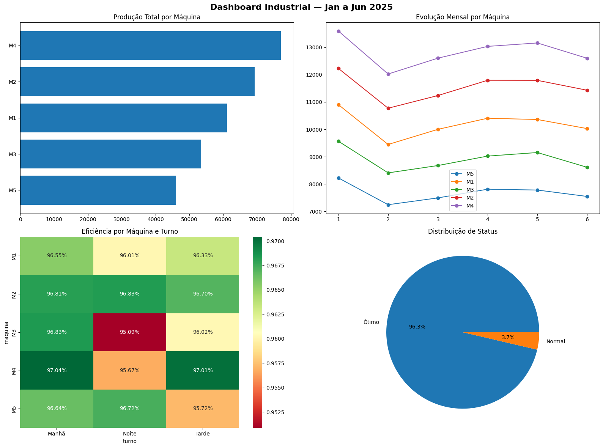

# 🏭 Análise de Produção Industrial

## Sobre o projeto
Análise completa de dados de produção de 5 máquinas industriais
ao longo de 6 meses, identificando padrões de eficiência e
gargalos operacionais.

## 📊 Dashboard



## 📝 Relatório Gerencial
```
==================================================
   RELATÓRIO GERENCIAL — PRODUÇÃO INDUSTRIAL
==================================================
 Período   : 01/01/2025 a 30/06/2025
 Registros : 1,935 turnos
--------------------------------------------------
  PRODUÇÃO
    Total produzido  : 306,986 unidades
    Média por turno  : 158.6 unidades
--------------------------------------------------
  EFICIÊNCIA
    Eficiência geral : 96.4%
    Turnos Ótimos    : 96.3%
    Turnos Críticos  : 0.0%
--------------------------------------------------
  DESTAQUES
     Máquina mais eficiente  : M2
     Máquina menos eficiente : M3
     Melhor operador         : Maria Lima
     Pior mês de produção    : Fevereiro
==================================================
```
## Ferramentas utilizadas
- Python, pandas, numpy
- matplotlib, seaborn
- Jupyter Notebook

## O que foi feito
- Limpeza e tratamento de dados (nulos, outliers, inconsistências)
- Criação de métricas: eficiência, status e produção normalizada
- Análise exploratória com groupby e pivot tables
- Dashboard visual com 4 subplots
- Relatório gerencial automatizado

## Principais insights
- M4 (Injetora) foi a máquina mais produtiva do período
- Turno da Noite apresenta menor eficiência em todas as máquinas
- M3 no turno noturno é o ponto mais crítico da operação
- Fevereiro foi o pior mês de produção

## Como executar
1. Clone o repositório
2. Instale as dependências: `pip install pandas numpy matplotlib seaborn`
3. Abra o notebook no Jupyter ou Google Colab
